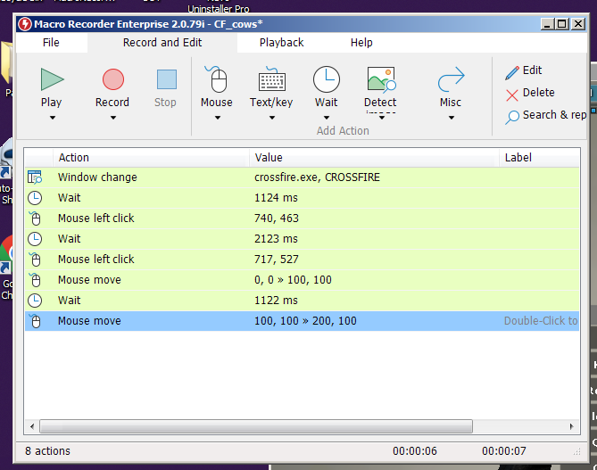
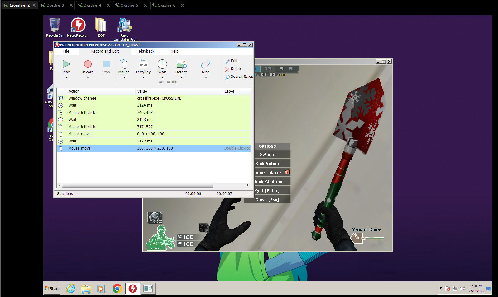

# AFK BOT Crossfire

> Now we will learn how to install and use the AFK Bot for Crossfire. I will also leave the parameters used for faster farming.

!!! tip
    This is mainly used for EXP/Badge/Event farming.  
    It prevents the bots from idling and ensures they're pressing ready after every match and clossing dialogs.

## Configure Crossfire Settings

Before we start we will have to configure our Crossfire in window mode.

## First method (MacroRecorder) (New)
### Download MacroRecorder + Cr4ck Bot for Crossfire

**Download the <a href="https://github.com/aircheats/vmware-cf-guide/raw/main/docs/crossfire/AntiAFKBot.zip" target="_blank">MacroRecorder+Cr4ck</a>.**

!!! note
    Although the program brings a K3yG3n we are not going to explain how to use it.

### Use MacroRecorder

!!! tip
    With this Program you can save configurations so as not to be repeating each time you go to spend it. With the AutoKey Bot no.

To start you will have to run the program as Administrator.

Once the program is open, we can record and create our custom macro or copy the one in the following image.

The macro of the image enters directly into the game by clicking on the ready / join button. The only thing you will have to do manually is create a room and put all the sheep inside it, once inside start the macros in each of the sheep.

## Second method 

### Download AutoKey Bot for Crossfire

**Download the <a href="https://github.com/aircheats/vmware-cf-guide/raw/main/docs/crossfire/Auto-Keybot_3.1.zip" target="_blank">AutoKey Bot</a>.**

### Use AutoKey Bot
> Coming soon...
