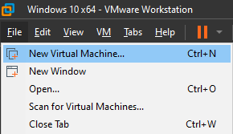
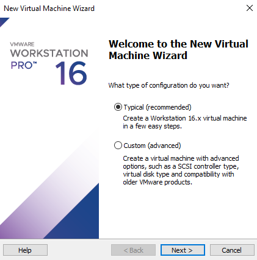
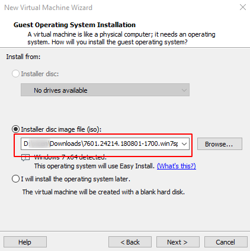
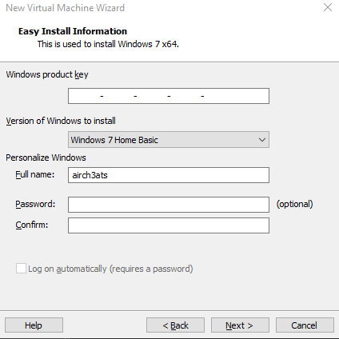
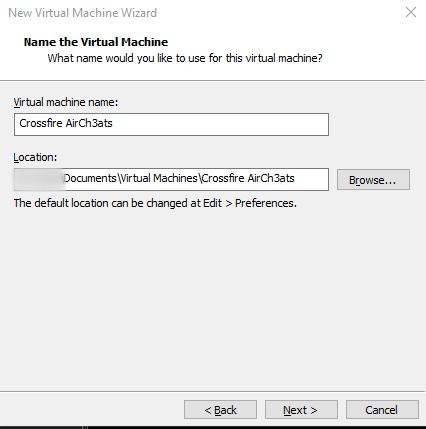
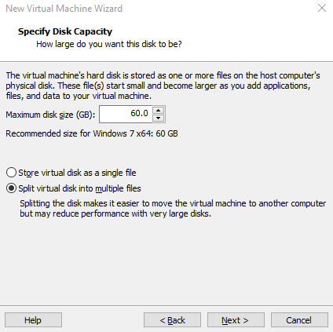
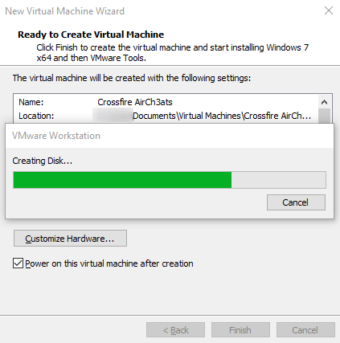
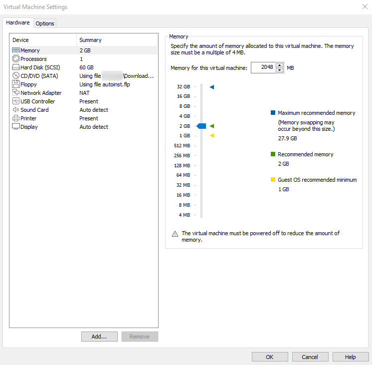
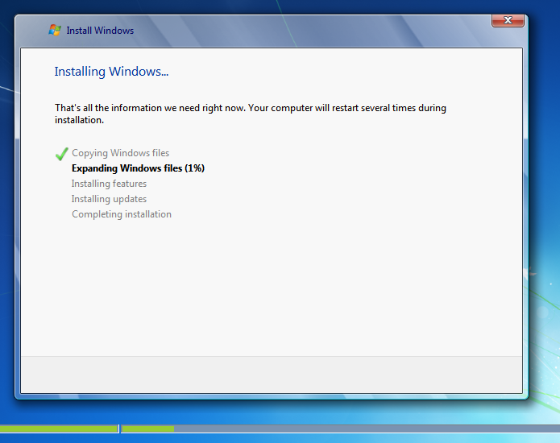

# Instructions - Creating a Virtual Machine

Open VMWare Workstation and Select `File -> New Virtual Machine`.

Now we select Typical installation.

Now we will have to select the previously downloaded Windows 7 ISO.

Fill out the Easy Install form to fullfill your needs.  
The only thing required by default is a username.  

!!! tip
    If you don't have a windows 7 license, you can leave the key empty. It will not give you any problem.

Name the virtual machine and then enter the size.

!!! note
    60 GB is the recomended.
    Crossfire takes at least +10GB
    

Now we press next and it will start with the creation of the virtual machine

!!! note
    Personally I leave the ram in 2GB. but you can increase or decrease it as you see necessary.

!!! tip
    Consider switching the Network Adapter to use a Bridget connection instead of NAT.  
    This avoids getting `Network Connection Errors` in CrossFire as each client gets its own IP-Address.

    
Now finish the installation of windows 7 normally.

