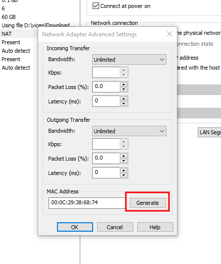

# Updating Virtual Machine Configuration

In order to run the Crossfire game in a virtual machine we have to modify the virtual machine configuration.

!!! info
    If you want to copy CrossFire from your Host System make sure to do this before adjusting the configuration.  
    It seems like adjusting the configuration will break drag-and-drop feature.

!!! tip
    To send files, use the WINDOWS shared folders, not VMWARE, or simply send the files before doing this process.


We close the virtual machine and right click on it and open its directory.


In the following folder we will have to locate a file with the extension .vmx and open it with any text editor.

!!! tip
    I recommend using Notepadd ++ or Visual Studio Code

Now in the .vmx file we have to add the following lines at the end:

```
hypervisor.cpuid.v0 = "FALSE"
board-id.reflectHost = "TRUE"
hw.model.reflectHost = "TRUE"
serialNumber.reflectHost = "TRUE"
smbios.reflectHost = "TRUE"
SMBIOS.noOEMStrings = "TRUE"
isolation.tools.getPtrLocation.disable = "TRUE"
isolation.tools.setPtrLocation.disable = "TRUE"
isolation.tools.setVersion.disable = "TRUE"
isolation.tools.getVersion.disable = "TRUE"
monitor_control.disable_directexec = "TRUE"
monitor_control.disable_chksimd = "TRUE"
monitor_control.disable_ntreloc = "TRUE"
monitor_control.disable_selfmod = "TRUE"
monitor_control.disable_reloc = "TRUE"
monitor_control.disable_btinout = "TRUE"
monitor_control.disable_btmemspace = "TRUE"
monitor_control.disable_btpriv = "TRUE"
monitor_control.disable_btseg = "TRUE"
monitor_control.restrict_backdoor = "TRUE"
scsi0:0.productID = "Tencent SSD"
scsi0:0.vendorID = "Tencent"
ethernet0.address = "00:11:56:20:D2:E8"
```

!!! info
    Credits and special thanks to 0vis (Discord: 0vis#1008) for providing the proper configuration properties above.


Save the file and close it.  

!!! note
    If you are going to use several virtual machines at the same time, you have to regenerate a new MAC address in each one




You can now power it up again and proceed with the registry patch.  
